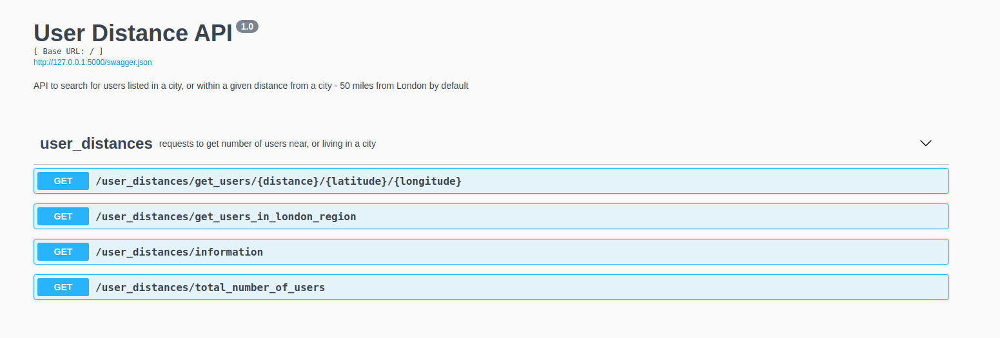

# Flask API demo to find users near London

Uses the bpdts-test-app API and returns users who are either listed as living in a given city or whose current location is within a requested number of miles of that city.

The available options are as follows:

- /get_users_in_london_region : this request returns the number of users who are either listed as living in London or whose current coordinates are within 50 miles of London. 

- ​/get_users​/{distance}​/{latitude}​/{longitude} : the more generic use-case for the above; this request will return the users within a requested distance of a requested place, given as latitude and longitude.

## Requirements

This project depends on Python 3, pip3 and virtualenv. Note these instructions were checked using Ubuntu 18.04, other systems may vary.

### Setup virtual environment and run demo locally

```bash
pip3 install virtualenv

which python3
virtualenv -p /output/from/which/python3 venv

source venv/bin/activate

#now within the virtual environment
pip install -r requirements.txt

#To run the flask api
python run.py

```

### Pytest

Tests can be run using pytest: 

```bash
python -m pytest -s tests
```

From the root of the project folder. 

## Using the API

Open a web-browser at 127.0.0.1:5000 to view API GUI and execute request there




The API requests can also be called directly, e.g.,

```bash
http://127.0.0.1:5000/user_distances/get_num_users_in_london/

http://127.0.0.1:5000/user_distances/get_num_users_in_london/?distance=50&latitude=51.506&longitude=-0.1272&city=London&return_users=false

```

***Please note that the distance parameter should be entered as a float - i.e, 50.0 not 50.*** 


## Using Docker with this demo

```bash
docker build -t flask_demo .
```

running the container

```bash
docker run -d --name container_name_1 -p 5000:5000 flask_demo
```

`--name` should be unique to each instance of run, and can be used to exec commands and kill container later.

Open Web browser at localhost:5000

### Executing the pytests in Docker

```bash
docker exec container_name_1 python -m pytest -s tests
```


