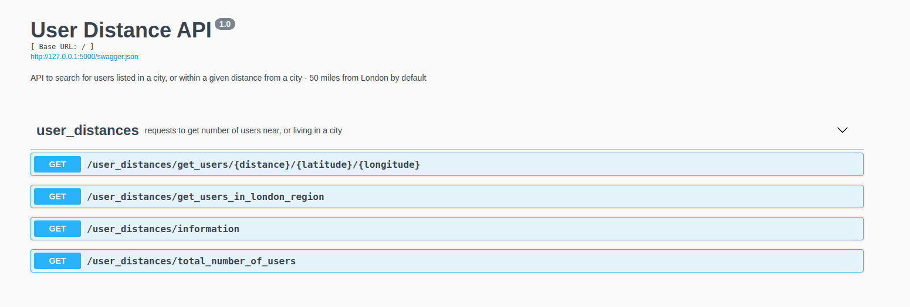

# Flask API demo to find users near London

Uses the bpdts-test-app API and returns users who are either listed as living in a given city or whose current location is within a requested number of miles of that city. This project was reimplemented in (!TypeScript)[https://github.com/pinpea/user-distance-api-ts)

The available options are as follows:

```http
localhost:5000/user_distances/get_number_of_users_in_range/
```

This request returns the number of users who are either listed as living in London or whose current coordinates are within 50 miles of London.

```http
localhost:5000/user_distances/get_number_of_users_in_range/?city=London&return_users=false&find_users_in_range=true&distance=50&latitude=51.506&longitude=-0.1272
```

This second request is the more generic use-case. With the default parameters, this request will return the same output as the first request.

```http
localhost:5000/user_distances/get_total_number_of_users
```

Returns the total number of users from the bptds-test-app API. Used for testing purposes.

```http
localhost:5000/user_distances/information
```

Used for testing.

## Requirements

This project depends on Python 3, pip3 and virtualenv. Note these instructions were checked using Ubuntu 18.04,and MacOS Catalina 10 other systems may vary. A Docker image with this demo is also available, see below.

### Setup virtual environment and run demo locally

```bash
pip3 install virtualenv

which python3
virtualenv -p /output/from/which/python3 venv

source venv/bin/activate

#now within the virtual environment
pip install -r requirements.txt

#To run the flask api
python run.py

```

### Run tests with Pytest

Tests can be run using pytest:

```bash
python -m pytest -s tests
```

From the root of the project folder.

## Using the API - Swagger

Open a web-browser at http://127.0.0.1:5000 (or localhost:5000) to view Swagger API GUI with documentation. Requests can be executed from the Swagger GUI.



The API requests can also be called directly, e.g.,

```http
http://127.0.0.1:5000/user_distances/get_number_of_users_in_range/

http://127.0.0.1:5000/user_distances/get_number_of_users_in_range/?city=London&return_users=false&find_users_in_range=true&distance=50&latitude=51.506&longitude=-0.1272

```

## Using this API with Docker

```bash
docker build -t flask_demo .
```

running the container

```bash
docker run -d --name container_name_1 -p 5000:5000 flask_demo
```

`--name` should be unique to each instance of run, and can be used to exec commands and kill container later.

Open Web browser at localhost:5000

### Run the tests with PyTest in Docker

```bash
docker exec container_name_1 python -m pytest -s tests
```

### To kill the container

If container has not already stopped, run:

```bash
docker kill container_name_1
```
